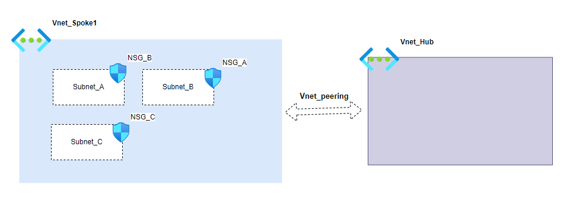

# Azure Vnet With multiple Subnet&Nsg and Vnet Perring

This module helps create an Azure spoke virtual network, peer it to a hub virtual network, and create multiple subnets within it, securing the subnets with network security groups .

<!-- BEGIN_TF_DOCS -->
## Requirements

No requirements.

## Providers

| Name | Version |
|------|---------|
|  [azurerm](#provider\_azurerm) | n/a |

## Modules

No modules.

## Resources

| Name | Type |
|------|------|
| [azurerm_network_security_group.nsgs](https://registry.terraform.io/providers/hashicorp/azurerm/latest/docs/resources/network_security_group) | resource |
| [azurerm_subnet.subnets](https://registry.terraform.io/providers/hashicorp/azurerm/latest/docs/resources/subnet) | resource |
| [azurerm_subnet_network_security_group_association.association](https://registry.terraform.io/providers/hashicorp/azurerm/latest/docs/resources/subnet_network_security_group_association) | resource |
| [azurerm_virtual_network.spoke](https://registry.terraform.io/providers/hashicorp/azurerm/latest/docs/resources/virtual_network) | resource |
| [azurerm_virtual_network_peering.hub_to_spoke](https://registry.terraform.io/providers/hashicorp/azurerm/latest/docs/resources/virtual_network_peering) | resource |
| [azurerm_virtual_network_peering.spoke_to_hub](https://registry.terraform.io/providers/hashicorp/azurerm/latest/docs/resources/virtual_network_peering) | resource |
| [azurerm_virtual_network.hub](https://registry.terraform.io/providers/hashicorp/azurerm/latest/docs/data-sources/virtual_network) | data source |

## Inputs

| Name | Description | Type | Default | Required |
|------|-------------|------|---------|:--------:|
|  [hub\_vnet\_name](#input\_hub\_vnet\_name) | The name of the  Hub Virtuel network | `string` | `"vnet_hub"` | no |
|  [location](#input\_location) | (Required) The location/region where the virtual network is created. Changing this forces a new resource to be created. | `string` | n/a | yes |
|  [rg\_name](#input\_rg\_name) | (Required) The name of the resource group in which to create the virtual network. Changing this forces a new resource to be created. | `string` | `"rg_network"` | no |
|  [spoke\_vnet\_name](#input\_spoke\_vnet\_name) | The Spoke virtuel network name | `string` | `"vnet-spoke-001"` | no |
|  [subnet\_nsg](#input\_subnet\_nsg) | Map of configuration settings for subnet and nsg | <pre>map(object({     subnet_name       = string     address_prefix    = list(string)     service_endpoints = list(string)     projet_tag        = optional(string)     security_rules = map(object({       priority                     = number       access                       = string       protocol                     = string       source_port_range            = optional(string)       source_port_ranges           = list(string)       destination_port_ranges      = list(string)       destination_port_range       = optional(string)       source_address_prefixes      = list(string)       source_address_prefix        = optional(string)       destination_address_prefix   = optional(string)       destination_address_prefixes = list(string)       description                  = string     }))   }))</pre> | n/a | yes |
|  [vnet\_address\_space](#input\_vnet\_address\_space) | (Required) The address space that is used the virtual network. You can supply more than one address space. | `list(string)` | n/a | yes |
|  [vnet\_tags](#input\_vnet\_tags) | A mapping of tags which should be assigned to the vnet | `map` | `{}` | no |

## Outputs

No outputs.
<!-- END_TF_DOCS -->